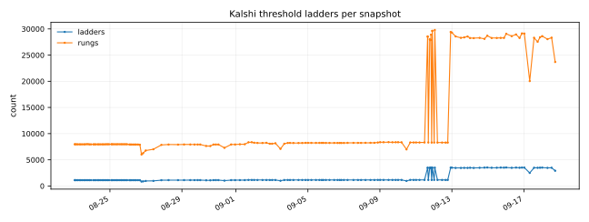
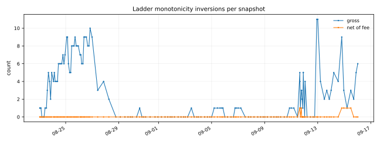
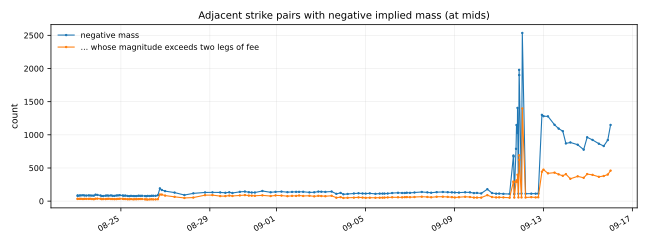
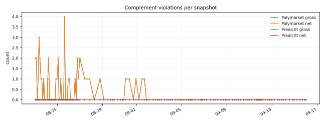
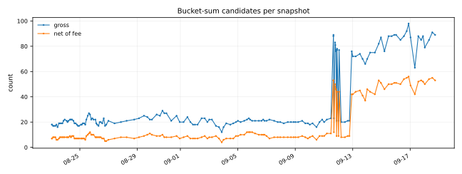

# Coherence over the archive

Generated 2026-09-11T18:53:18Z by `python -m pmlab.replay` at commit `1609c8d47d83`.

**Archive replayed:** 120 snapshots, 2026-08-23T01:18:06Z to 2026-09-11T18:27:56Z (19.7 days), realised cadence median 3.3 h / max 12.6 h.  
**Archive identity (sha256 of the blob list):** `2851127e2e32059eaf5e6b35c355dd2e72e2cacf8313678fa199da31c97e07d8`

Every count below is produced twice: **gross**, and **net** of the venue's own fee with the venue's own rounding. The gap between the two columns is the result.

## The one-line answer

Across 120 snapshots and 19.7 days, 303 gross ladder monotonicity inversions were found and 3 survived the fee model; 0 PredictIt and 43 Polymarket complement violations gross, 0 and 43 net; a median 20 bucket-sum candidates per snapshot gross and 8 net, all open-universe events. The Kalshi complement identity held on 1,618,215 of 1,618,215 two-sided books.

Every inversion that survived the fee is in 1 event(s): `KXINXMINY-01JAN2027`. Those are the rows to go and read by hand; everything else in this file is a count.

## Kalshi ladders

| quantity | value |
|---|---|
| ladders per snapshot (median) | 1,120 |
| ladders per snapshot (min-max, across both recorders) | 848-3,476 |
| rungs per snapshot (median) | 7,975 |
| adjacent strike pairs tested (total) | 879,367 |
| monotonicity inversions, gross (total) | 303 |
| monotonicity inversions, net of fee (total) | 3 |
| snapshots with any gross inversion | 65 of 120 |
| negative implied mass at mids, gross (total) | 15,192 |
| ... whose magnitude exceeds two legs of fee | 7,180 |

Worst gross inversion: `KXFEDFUNDSYEAR-32JAN01` on 2026-08-26T09:05:55Z, strike 2.25 ask 0.62 against strike 2.5 bid 0.65 -- 3.0c gross, 4.0c of fee on the two legs, -1.0c net.

Recorder v1 stopped at 2,000 events (about 14,000 markets, mostly the two midterm ladder families); recorder v2 sweeps the whole open catalog (about 56,000). Pooling the two counts a different experiment twice, so they are split:

| recorder | snapshots | adjacent pairs | inversions gross | net of fee |
|---|---|---|---|---|
| v1 (2,000-event cap) | 117 | 804,708 | 291 | 0 |
| v2 (full catalog) | 3 | 74,659 | 12 | 3 |

Those 303 inversions are not spread across the catalog: they fall in 26 events.

| event | gross inversions |
|---|---|
| `KXFEDFUNDSYEAR-32JAN01` | 89 |
| `KXFEDFUNDSYEAR-37JAN01` | 52 |
| `KXFEDFUNDSYEAR-34JAN01` | 33 |
| `KXUSCPIYEAR-30FEB01` | 24 |
| `KXFEDFUNDSYEAR-31JAN01` | 19 |
| `KXFEDFUNDSYEAR-33JAN01` | 19 |
| `KXFEDFUNDSYEAR-35JAN01` | 17 |
| `KXFEDFUNDSYEAR-36JAN01` | 10 |
| `KXLFPRATEEOY-33JAN07` | 5 |
| `KXMIDTERMMOV-MO06R` | 5 |

The inversion screen is at the touch and is executable by construction: sell the higher strike at its bid, buy the lower at its ask. The negative-mass screen is at mids and is **not** a trade -- it says where the quoted curve is marked impossibly, which is a wider and softer statement. The two must not be read as the same number.

## Complement

| venue | pairs per snapshot (median) | gross (total) | net (total) |
|---|---|---|---|
| Polymarket (quoted outcome pair) | 942 | 43 | 43 |
| PredictIt (YES/NO asks) | 495 | 0 | 0 |
| Kalshi | not screened | - | - |

Kalshi is not screened on purpose: `no_ask == 1 - yes_bid` held on 1,618,215 of 1,618,215 two-sided books across the whole archive (0 deviations), so YES ask plus NO ask is 1 plus the spread by construction and the screen cannot fire. It is asserted as an invariant: a single deviation fails this replay.

Screened on the venue's quoted outcome-price pair, not on two asks: the complementary token's book is not in this archive (a recorder gap). A violation is an incoherent quote, not a demonstrated trade.

All 43 Polymarket violations fall in the 68 snapshots of the string-sorted era (2026-08-23 to 2026-09-01T16:44Z), when the venue served `order=liquidity` sorted as text and the recorder kept the result: thin, often already-expired rows. The 52 snapshots of the clean `liquidityNum` era carry 0. That is a statement about the recorder, not about the venue's quotes.

## Bucket sums

| quantity | value |
|---|---|
| mutually-exclusive events screened per snapshot (median) | 228 |
| candidates per snapshot, gross (median) | 20 |
| candidates per snapshot, net of fee (median) | 8 |

Most persistent candidates (snapshots in which the event was flagged):

| event | snapshots |
|---|---|
| `KXMOLDOVAPRES-28` | 120 |
| `KXNEWPOPE-70` | 120 |
| `KXNEXTSTATE-29` | 120 |
| `KXPRESMATCHUP-28NOV07` | 120 |
| `KXSENATENYD-28` | 120 |
| `KXSTATE51-29` | 120 |
| `KXTRUMPAGCOUNT-29` | 120 |
| `KXVPRESNOMR-28` | 120 |
| `KXNEXTDEPUTYAG-28JAN01` | 119 |
| `KXPRESTAIWAN-28` | 119 |

A bucket-sum candidate is NOT an arbitrage. The venue's mutually_exclusive flag promises at most one bucket settles YES, not that the listed buckets are exhaustive; the survivors on real data are open-universe events (next pope, 51st state, party nominations) whose missing 'someone else' bucket is exactly the mass that makes the asks sum below a dollar. Read the event rules before believing any row of this table.

## Fee models in force

Constants read 2026-09-11.

| venue | model |
|---|---|
| kalshi | taker fee = ceil to the cent of 0.07 * contracts * P * (1-P), per order; minimum one cent per order with any risk |
| polymarket | no taker fee on the CLOB; per-market overrides supported |
| predictit | 10% of profit on the winning leg, plus 5% on withdrawal |

- **kalshi:** the reduced-multiplier series table is EMPTY (the fee schedule PDF has not been read here), so every series is charged the general 0.07 multiplier
- **polymarket:** with a zero fee the net numbers equal the gross ones by construction; they are reported separately anyway so the day a fee appears the table changes on its own
- **predictit:** the profit fee is charged per winning position, so a complement pair is quoted at its worst case

## Figures











## Reproduce

```
python -m pmlab.replay --roots data
```

`timeseries.csv` carries one row per snapshot and every column behind these tables; `summary.json` carries the same numbers plus the worst case for each screen with its ticker. Neither file is edited by hand.
