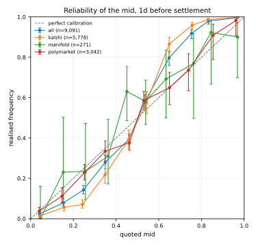
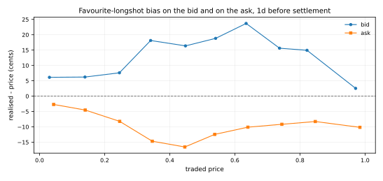

# Coherence over the archive

Generated 2026-09-11T19:51:55Z by `python -m pmlab.replay` at commit `cec89e4c6e9a`.

**Archive replayed:** 121 snapshots, 2026-08-23T01:18:06Z to 2026-09-11T18:58:42Z (19.7 days), realised cadence median 3.3 h / max 12.6 h.  
**Archive identity (sha256 of the blob list):** `94708f0191ab79ed50ea467756ac62df7789b61bd9d96f8fa94d07ccf353f47e`

Every count below is produced twice: **gross**, and **net** of the venue's own fee with the venue's own rounding. The gap between the two columns is the result.

## The one-line answer

Across 121 snapshots and 19.7 days, 306 gross ladder monotonicity inversions were found and 3 survived the fee model; 0 PredictIt and 43 Polymarket complement violations gross, 0 and 43 net; a median 20 bucket-sum candidates per snapshot gross and 8 net, all open-universe events. The Kalshi complement identity held on 1,663,501 of 1,663,501 two-sided books.

Every inversion that survived the fee is in 1 event(s): `KXINXMINY-01JAN2027`. Those are the rows to go and read by hand; everything else in this file is a count.

## Kalshi ladders

| quantity | value |
|---|---|
| ladders per snapshot (median) | 1,120 |
| ladders per snapshot (min-max, across both recorders) | 848-3,476 |
| rungs per snapshot (median) | 7,975 |
| adjacent strike pairs tested (total) | 903,775 |
| monotonicity inversions, gross (total) | 306 |
| monotonicity inversions, net of fee (total) | 3 |
| snapshots with any gross inversion | 66 of 121 |
| negative implied mass at mids, gross (total) | 16,340 |
| ... whose magnitude exceeds two legs of fee | 7,493 |

Worst gross inversion: `KXFEDFUNDSYEAR-32JAN01` on 2026-08-26T09:05:55Z, strike 2.25 ask 0.62 against strike 2.5 bid 0.65 -- 3.0c gross, 4.0c of fee on the two legs, -1.0c net.

Recorder v1 stopped at 2,000 events (about 14,000 markets, mostly the two midterm ladder families); recorder v2 sweeps the whole open catalog (about 56,000). Pooling the two counts a different experiment twice, so they are split:

| recorder | snapshots | adjacent pairs | inversions gross | net of fee |
|---|---|---|---|---|
| v1 (2,000-event cap) | 117 | 804,708 | 291 | 0 |
| v2 (full catalog) | 4 | 99,067 | 15 | 3 |

Those 306 inversions are not spread across the catalog: they fall in 27 events.

| event | gross inversions |
|---|---|
| `KXFEDFUNDSYEAR-32JAN01` | 89 |
| `KXFEDFUNDSYEAR-37JAN01` | 52 |
| `KXFEDFUNDSYEAR-34JAN01` | 33 |
| `KXUSCPIYEAR-30FEB01` | 24 |
| `KXFEDFUNDSYEAR-31JAN01` | 19 |
| `KXFEDFUNDSYEAR-33JAN01` | 19 |
| `KXFEDFUNDSYEAR-35JAN01` | 17 |
| `KXFEDFUNDSYEAR-36JAN01` | 10 |
| `KXLFPRATEEOY-33JAN07` | 5 |
| `KXMIDTERMMOV-MO06R` | 5 |

The inversion screen is at the touch and is executable by construction: sell the higher strike at its bid, buy the lower at its ask. The negative-mass screen is at mids and is **not** a trade -- it says where the quoted curve is marked impossibly, which is a wider and softer statement. The two must not be read as the same number.

## Complement

| venue | pairs per snapshot (median) | gross (total) | net (total) |
|---|---|---|---|
| Polymarket (quoted outcome pair) | 942 | 43 | 43 |
| PredictIt (YES/NO asks) | 495 | 0 | 0 |
| Kalshi | not screened | - | - |

Kalshi is not screened on purpose: `no_ask == 1 - yes_bid` held on 1,663,501 of 1,663,501 two-sided books across the whole archive (0 deviations), so YES ask plus NO ask is 1 plus the spread by construction and the screen cannot fire. It is asserted as an invariant: a single deviation fails this replay.

Screened on the venue's quoted outcome-price pair, not on two asks: the complementary token's book is not in this archive (a recorder gap). A violation is an incoherent quote, not a demonstrated trade.

All 43 Polymarket violations fall in the 68 snapshots of the string-sorted era (2026-08-23 to 2026-09-01T16:44Z), when the venue served `order=liquidity` sorted as text and the recorder kept the result: thin, often already-expired rows. The 53 snapshots of the clean `liquidityNum` era carry 0. That is a statement about the recorder, not about the venue's quotes.

## Bucket sums

| quantity | value |
|---|---|
| mutually-exclusive events screened per snapshot (median) | 228 |
| candidates per snapshot, gross (median) | 20 |
| candidates per snapshot, net of fee (median) | 8 |

Most persistent candidates (snapshots in which the event was flagged):

| event | snapshots |
|---|---|
| `KXMOLDOVAPRES-28` | 121 |
| `KXNEWPOPE-70` | 121 |
| `KXNEXTSTATE-29` | 121 |
| `KXPRESMATCHUP-28NOV07` | 121 |
| `KXSENATENYD-28` | 121 |
| `KXSTATE51-29` | 121 |
| `KXTRUMPAGCOUNT-29` | 121 |
| `KXVPRESNOMR-28` | 121 |
| `KXNEXTDEPUTYAG-28JAN01` | 120 |
| `KXPRESTAIWAN-28` | 120 |

A bucket-sum candidate is NOT an arbitrage. The venue's mutually_exclusive flag promises at most one bucket settles YES, not that the listed buckets are exhaustive; the survivors on real data are open-universe events (next pope, 51st state, party nominations) whose missing 'someone else' bucket is exactly the mass that makes the asks sum below a dollar. Read the event rules before believing any row of this table.

## Calibration

Settlements read: 28,269 markets from 19 file(s) (kalshi 4,949, manifold 451, polymarket 22,722, predictit 147). Scored forecasts: 4,587 (plus 49 inferred PredictIt outcomes held out of every headline number).

Each market is scored at the **last quote at or before `settled_at - H`**, used only if it is no more than 24 h older than that cut-off. 15,595 market/horizon cells had a quote before the cut-off but only a stale one, and 967 had only a one-sided book; both are reported unscored rather than scored on a price nobody was quoting. The baseline everywhere is a coin flip: Brier 0.25, log score -0.6931.

**Read the `blocks` column before the `n` column.** A block is one venue's settlements on one day, and markets that resolve together do not resolve independently: a thousand forecasts spread over four settlement days is four observations of the world wearing a large `n`. The block bootstrap prices that in and the Wilson interval does not; below 3 blocks no bootstrap interval is reported at all, because resampling two blocks produces an interval about the block count rather than about the data.

### By horizon

| horizon | n | blocks | Brier | 95% block bootstrap | skill vs 50/50 | log score | base rate | median h before settlement |
|---|---|---|---|---|---|---|---|---|
| 1d (1 d) | 3,084 | 52 | 0.1538 | [0.1370, 0.1675] | 0.385 | -0.4584 | 0.381 | 30.7 |
| 1wk (7 d) | 1,503 | 34 | 0.1954 | [0.1582, 0.2205] | 0.218 | -0.5573 | 0.363 | 174.9 |
| 1mo (30 d) | 0 | 0 | - | - | - | - | - | - |
| 2mo (60 d) | 0 | 0 | - | - | - | - | - | - |

- **1mo** is empty because no settled market resolved on or after 2026-09-22T01:18:06Z, which is the earliest settlement this archive can price 1mo ahead (it opens 2026-08-23).
- **2mo** is empty because no settled market resolved on or after 2026-10-22T01:18:06Z, which is the earliest settlement this archive can price 2mo ahead (it opens 2026-08-23).

### By venue and horizon

| venue | horizon | n | blocks | Brier | skill vs 50/50 | log score | mean mid | base rate | median spread (c) |
|---|---|---|---|---|---|---|---|---|---|
| kalshi | 1d | 243 | 14 | 0.0161 | 0.936 | -0.0659 | 0.911 | 0.909 | 1.0 |
| kalshi | 1wk | 159 | 9 | 0.0448 | 0.821 | -0.1749 | 0.534 | 0.478 | 3.0 |
| polymarket | 1d | 2,616 | 19 | 0.1634 | 0.346 | -0.4864 | 0.339 | 0.318 | 5.0 |
| polymarket | 1wk | 1,219 | 12 | 0.2173 | 0.131 | -0.6121 | 0.439 | 0.334 | 92.0 |
| manifold | 1d | 225 | 19 | 0.1917 | 0.233 | -0.5561 | 0.497 | 0.533 | 0.0 |
| manifold | 1wk | 125 | 13 | 0.1734 | 0.306 | -0.5089 | 0.483 | 0.496 | 0.0 |

Everything below is the **1d** horizon, the shortest one this archive can fill.

### What this sample is

3,084 forecasts from 52 venue-days: kalshi 243, manifold 225, polymarket 2,616; Polymarket recorder era numeric 283, string_sorted 2,333.

| settlement day | forecasts |
|---|---|
| polymarket:2026-08-27 | 347 |
| polymarket:2026-08-26 | 335 |
| polymarket:2026-08-25 | 323 |
| polymarket:2026-08-30 | 288 |
| polymarket:2026-08-31 | 227 |
| polymarket:2026-08-24 | 220 |
| polymarket:2026-08-29 | 205 |
| polymarket:2026-08-28 | 151 |

Nothing here is a random sample of a venue's catalog. It is the set of markets that happened to resolve inside a three-week recording window, which skews hard towards short-dated sports and towards whatever the recorder's Polymarket slice contained at the time. Read every score below as a description of that set, not as a venue's calibration.

Join sanity check (not a result): markets that settled YES were quoted at a mean mid of 0.605 and markets that settled NO at 0.267. If the outcome were joined to the wrong side of the book these would be the wrong way round.

### Reliability

Wilson intervals assume the forecasts in a bin are independent. Markets that settle on the same day are not, so a block bootstrap over (venue, settlement day) blocks is reported beside them; where the two disagree, the bootstrap is the honest one.

**all** (52 settlement-day block(s))

| bin | n | mean mid | realised | Wilson 95% | bootstrap 95% |
|---|---|---|---|---|---|
| 0.0-0.1 | 578 | 0.040 | 0.036 | [0.024, 0.055] | [0.015, 0.061] |
| 0.1-0.2 | 260 | 0.146 | 0.108 | [0.076, 0.151] | [0.074, 0.146] |
| 0.2-0.3 | 405 | 0.251 | 0.222 | [0.184, 0.265] | [0.178, 0.281] |
| 0.3-0.4 | 330 | 0.350 | 0.339 | [0.290, 0.392] | [0.286, 0.389] |
| 0.4-0.5 | 553 | 0.462 | 0.374 | [0.335, 0.415] | [0.335, 0.419] |
| 0.5-0.6 | 404 | 0.530 | 0.589 | [0.541, 0.636] | [0.553, 0.627] |
| 0.6-0.7 | 135 | 0.650 | 0.674 | [0.591, 0.747] | [0.615, 0.728] |
| 0.7-0.8 | 86 | 0.741 | 0.744 | [0.643, 0.825] | [0.592, 0.855] |
| 0.8-0.9 | 49 | 0.855 | 0.878 | [0.758, 0.943] | [0.771, 0.971] |
| 0.9-1.0 | 284 | 0.985 | 0.986 | [0.964, 0.995] | [0.966, 0.997] |

**kalshi** (14 settlement-day block(s))

| bin | n | mean mid | realised | Wilson 95% | bootstrap 95% |
|---|---|---|---|---|---|
| 0.0-0.1 | 16 | 0.039 | 0.000 | [0.000, 0.194] | [0.000, 0.000] |
| 0.1-0.2 | 3 | 0.135 | 0.333 | [0.061, 0.792] | [0.000, 1.000] |
| 0.3-0.4 | 1 | 0.385 | 0.000 | [0.000, 0.793] | [0.000, 0.000] |
| 0.6-0.7 | 3 | 0.658 | 1.000 | [0.439, 1.000] | [1.000, 1.000] |
| 0.8-0.9 | 3 | 0.863 | 0.667 | [0.208, 0.939] | [0.000, 1.000] |
| 0.9-1.0 | 217 | 0.992 | 0.991 | [0.967, 0.997] | [0.971, 1.000] |

**manifold** (19 settlement-day block(s))

| bin | n | mean mid | realised | Wilson 95% | bootstrap 95% |
|---|---|---|---|---|---|
| 0.0-0.1 | 19 | 0.045 | 0.000 | [0.000, 0.168] | [0.000, 0.000] |
| 0.1-0.2 | 11 | 0.152 | 0.182 | [0.051, 0.477] | [0.000, 0.455] |
| 0.2-0.3 | 14 | 0.258 | 0.286 | [0.117, 0.546] | [0.077, 0.556] |
| 0.3-0.4 | 23 | 0.361 | 0.348 | [0.188, 0.551] | [0.182, 0.500] |
| 0.4-0.5 | 39 | 0.450 | 0.590 | [0.434, 0.729] | [0.379, 0.757] |
| 0.5-0.6 | 54 | 0.541 | 0.593 | [0.460, 0.713] | [0.471, 0.702] |
| 0.6-0.7 | 24 | 0.635 | 0.667 | [0.467, 0.820] | [0.478, 0.846] |
| 0.7-0.8 | 13 | 0.763 | 0.769 | [0.497, 0.918] | [0.545, 1.000] |
| 0.8-0.9 | 13 | 0.845 | 0.923 | [0.667, 0.986] | [0.765, 1.000] |
| 0.9-1.0 | 15 | 0.965 | 0.867 | [0.621, 0.963] | [0.706, 1.000] |

**polymarket** (19 settlement-day block(s))

| bin | n | mean mid | realised | Wilson 95% | bootstrap 95% |
|---|---|---|---|---|---|
| 0.0-0.1 | 543 | 0.040 | 0.039 | [0.025, 0.058] | [0.016, 0.063] |
| 0.1-0.2 | 246 | 0.146 | 0.102 | [0.070, 0.146] | [0.067, 0.135] |
| 0.2-0.3 | 391 | 0.251 | 0.220 | [0.182, 0.264] | [0.169, 0.283] |
| 0.3-0.4 | 306 | 0.349 | 0.340 | [0.289, 0.395] | [0.281, 0.392] |
| 0.4-0.5 | 514 | 0.463 | 0.358 | [0.318, 0.400] | [0.315, 0.395] |
| 0.5-0.6 | 350 | 0.528 | 0.589 | [0.536, 0.639] | [0.552, 0.632] |
| 0.6-0.7 | 108 | 0.653 | 0.667 | [0.573, 0.748] | [0.621, 0.708] |
| 0.7-0.8 | 73 | 0.737 | 0.740 | [0.629, 0.827] | [0.583, 0.848] |
| 0.8-0.9 | 33 | 0.858 | 0.879 | [0.727, 0.952] | [0.762, 1.000] |
| 0.9-1.0 | 52 | 0.961 | 1.000 | [0.931, 1.000] | [1.000, 1.000] |

### Favourite-longshot bias, on the bid and on the ask

Measured on the traded prices, never on the mid: a longshot buyer pays the ask and a favourite seller receives the bid. `bias` is realised frequency minus mean price in cents, so a negative number means that side was dearer than it was worth.

Manifold quotes a single probability rather than a book, so its bid and ask columns carry the same number; the venue split says how much of each row that is.

**Read the spread column with the bias column.** A two-sided book is not the same thing as a tradeable one: a bin whose median spread is most of a dollar is a bin of nominal quotes sitting on near-empty books, and most of its apparent bias is that fact rather than a market view. The rows are reported rather than filtered out, because picking a spread cut-off is a judgement and applying one silently would be making that judgement for the reader.

**bid**

| bin | n | mean price | realised | bias (c) | median spread (c) | Wilson 95% |
|---|---|---|---|---|---|---|
| 0.0-0.1 | 1,275 | 0.029 | 0.166 | 13.7 | 21.0 | [0.147, 0.188] |
| 0.1-0.2 | 253 | 0.143 | 0.221 | 7.9 | 3.0 | [0.175, 0.276] |
| 0.2-0.3 | 309 | 0.245 | 0.269 | 2.3 | 3.0 | [0.222, 0.321] |
| 0.3-0.4 | 257 | 0.347 | 0.432 | 8.5 | 4.0 | [0.373, 0.493] |
| 0.4-0.5 | 266 | 0.448 | 0.500 | 5.2 | 3.0 | [0.440, 0.560] |
| 0.5-0.6 | 208 | 0.541 | 0.615 | 7.5 | 1.0 | [0.548, 0.679] |
| 0.6-0.7 | 134 | 0.647 | 0.672 | 2.5 | 4.0 | [0.588, 0.745] |
| 0.7-0.8 | 60 | 0.741 | 0.800 | 5.9 | 4.0 | [0.682, 0.882] |
| 0.8-0.9 | 51 | 0.849 | 0.882 | 3.4 | 3.0 | [0.766, 0.945] |
| 0.9-1.0 | 271 | 0.982 | 0.989 | 0.7 | 1.0 | [0.968, 0.996] |

**ask**

| bin | n | mean price | realised | bias (c) | median spread (c) | Wilson 95% |
|---|---|---|---|---|---|---|
| 0.0-0.1 | 485 | 0.041 | 0.025 | -1.7 | 1.6 | [0.014, 0.043] |
| 0.1-0.2 | 263 | 0.142 | 0.106 | -3.6 | 3.0 | [0.075, 0.150] |
| 0.2-0.3 | 272 | 0.247 | 0.184 | -6.3 | 2.0 | [0.142, 0.234] |
| 0.3-0.4 | 269 | 0.347 | 0.323 | -2.3 | 3.0 | [0.270, 0.381] |
| 0.4-0.5 | 328 | 0.447 | 0.409 | -3.8 | 6.0 | [0.357, 0.462] |
| 0.5-0.6 | 358 | 0.537 | 0.461 | -7.6 | 5.0 | [0.410, 0.513] |
| 0.6-0.7 | 169 | 0.639 | 0.556 | -8.3 | 5.0 | [0.481, 0.629] |
| 0.7-0.8 | 138 | 0.743 | 0.616 | -12.7 | 8.0 | [0.533, 0.693] |
| 0.8-0.9 | 123 | 0.847 | 0.561 | -28.6 | 62.0 | [0.473, 0.646] |
| 0.9-1.0 | 679 | 0.971 | 0.663 | -30.9 | 86.0 | [0.626, 0.697] |

### By category

| slice | n | blocks | Brier | skill vs 50/50 | log score | base rate |
|---|---|---|---|---|---|---|
| Elections | 222 | 11 | 0.0157 | 0.937 | -0.0629 | 0.941 |
| Entertainment | 4 | 2 | 0.0653 | 0.739 | -0.2536 | 1.000 |
| Politics | 5 | 3 | 0.0228 | 0.909 | -0.0968 | 0.600 |
| Sports | 12 | 4 | 0.0039 | 0.984 | -0.0463 | 0.417 |
| unknown | 2,841 | 38 | 0.1656 | 0.337 | -0.4919 | 0.335 |

Category is recorded on Kalshi only; the recorder captures no category for Polymarket or Manifold, so every row from those venues is `unknown`. That is a recorder gap, not a market fact.

### By liquidity bucket

| slice | n | blocks | Brier | skill vs 50/50 | log score | base rate |
|---|---|---|---|---|---|---|
| 100-1k | 1,071 | 19 | 0.1389 | 0.444 | -0.4226 | 0.324 |
| 10k-100k | 160 | 23 | 0.1241 | 0.504 | -0.3857 | 0.388 |
| 1k-10k | 688 | 23 | 0.1235 | 0.506 | -0.3736 | 0.485 |
| <100 | 762 | 14 | 0.1936 | 0.225 | -0.5612 | 0.329 |
| >=100k | 178 | 14 | 0.1697 | 0.321 | -0.5031 | 0.337 |
| unknown | 225 | 19 | 0.1917 | 0.233 | -0.5561 | 0.533 |

Each venue's own liquidity measure, so these bands compare markets within a venue and not across venues: kalshi = open_interest (contracts); manifold = totalLiquidity; polymarket = liquidityNum (USD); predictit = none recorded

### By Polymarket recorder era

| slice | n | blocks | Brier | skill vs 50/50 | log score | base rate |
|---|---|---|---|---|---|---|
| numeric | 283 | 10 | 0.1629 | 0.348 | -0.4825 | 0.290 |
| string_sorted | 2,333 | 11 | 0.1634 | 0.346 | -0.4869 | 0.322 |

The string-sorted era is the nine days the venue served `order=liquidity` as text and the recorder kept the result.

### Inferred outcomes (excluded from every number above)

PredictIt outcomes are inferred from the last trade of a contract that left the public feed, not observed. These scores are reported so the inference can be judged, and are excluded from every headline number.

| horizon | n | Brier | skill vs 50/50 |
|---|---|---|---|
| 1d | 16 | 0.1419 | 0.432 |
| 1wk | 33 | 0.1427 | 0.429 |

Settlement records read but not scoreable:

| venue | reason | records |
|---|---|---|
| kalshi | result=scalar | 3 |
| manifold | resolution=CANCEL | 19 |
| manifold | resolution=MKT | 12 |
| polymarket | outcome price not 0 or 1 | 95 |

## Cross-venue basis

Curation rule: **identical entity and identical deadline on both venues, read off both rules pages by a person; no fuzzy matching**.

`events.yaml`: 5 pair(s), 0 verified, 5 awaiting a hand check.

No verified cross-venue pair is in events.yaml, so there is no basis to measure. The file ships as a skeleton of examples marked `verified: false`; pairing is a hand check of both venues' rules pages (identical entity, identical deadline) and unverified pairs are counted here and never priced.

Awaiting verification: `fed-2026-09-hike-25bp`, `fed-2026-09-hike-any`, `govt-shutdown-2026-10-01`, `nobel-peace-2026-musk`, `recession-2027-nber`.

## Fee models in force

Constants read 2026-09-11.

| venue | model |
|---|---|
| kalshi | taker fee = ceil to the cent of 0.07 * contracts * P * (1-P), per order; minimum one cent per order with any risk |
| polymarket | no taker fee on the CLOB; per-market overrides supported |
| predictit | 10% of profit on the winning leg, plus 5% on withdrawal |

- **kalshi:** the reduced-multiplier series table is EMPTY (the fee schedule PDF has not been read here), so every series is charged the general 0.07 multiplier
- **polymarket:** with a zero fee the net numbers equal the gross ones by construction; they are reported separately anyway so the day a fee appears the table changes on its own
- **predictit:** the profit fee is charged per winning position, so a complement pair is quoted at its worst case

## Figures






## Reproduce

```
python -m pmlab.replay --roots data
```

`timeseries.csv` carries one row per snapshot and every column behind these tables; `summary.json` carries the same numbers plus the worst case for each screen with its ticker. Neither file is edited by hand.
